# 30DayChartChallenge2022

My submissions for the [#30DayChartChallenge](https://github.com/dominicroye/30DayChartChallenge_Edition2022) held on April 2022.

### Day 1. part-to-whole

  
Click to expand!

### Day 2. pictogram

  
Click to expand!

### Day 3. historical

  
Click to expand!

  
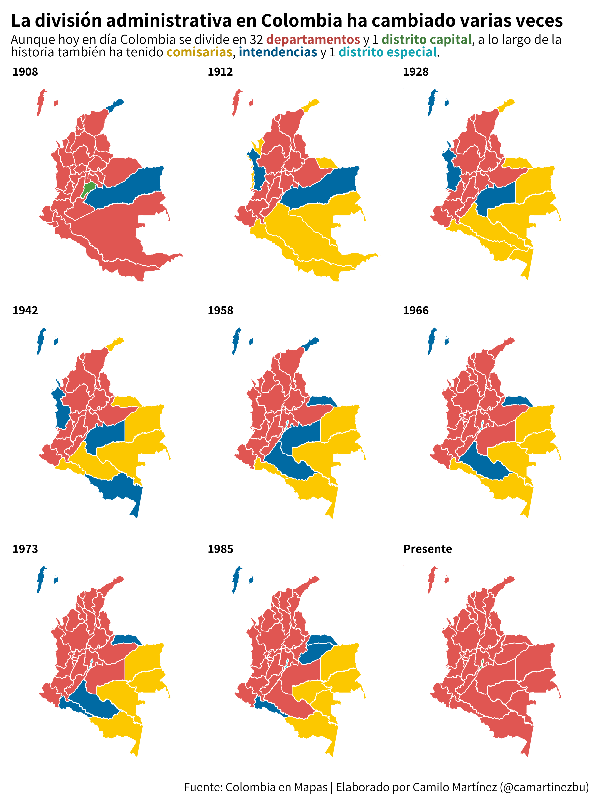

### Day 4. flora

  
Click to expand!

  
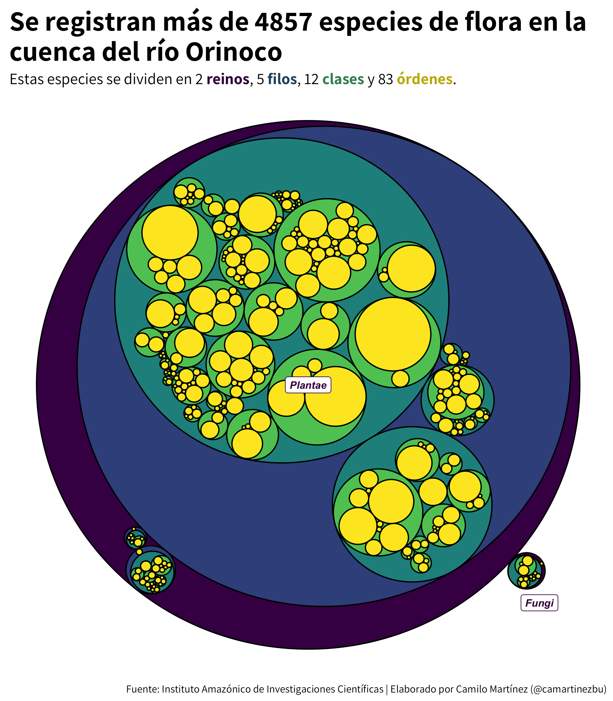

### Day 5. slope

  
Click to expand!

  
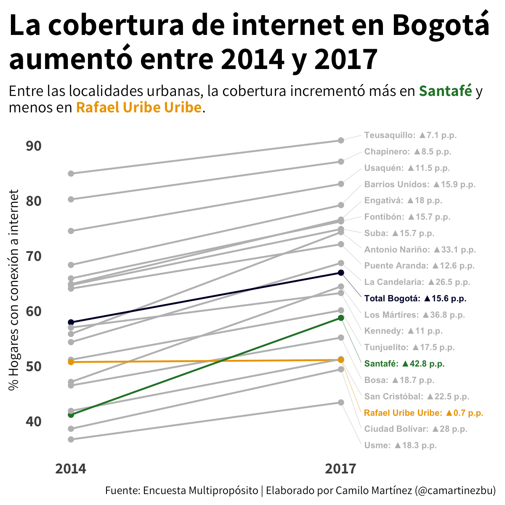

### Day 6. data day: OWID

  
Click to expand!

  
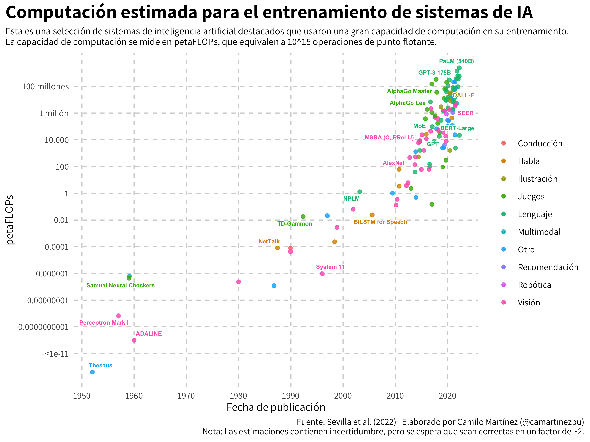

### Day 7. physical

  
Click to expand!

  
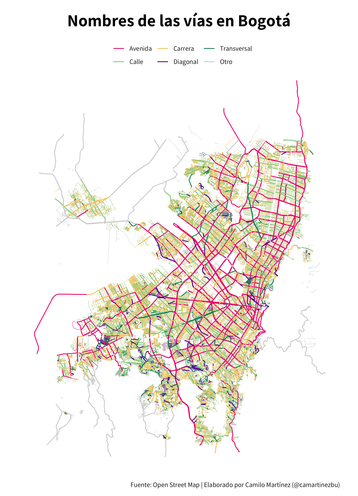

### Day 8. mountains

  
Click to expand!

  
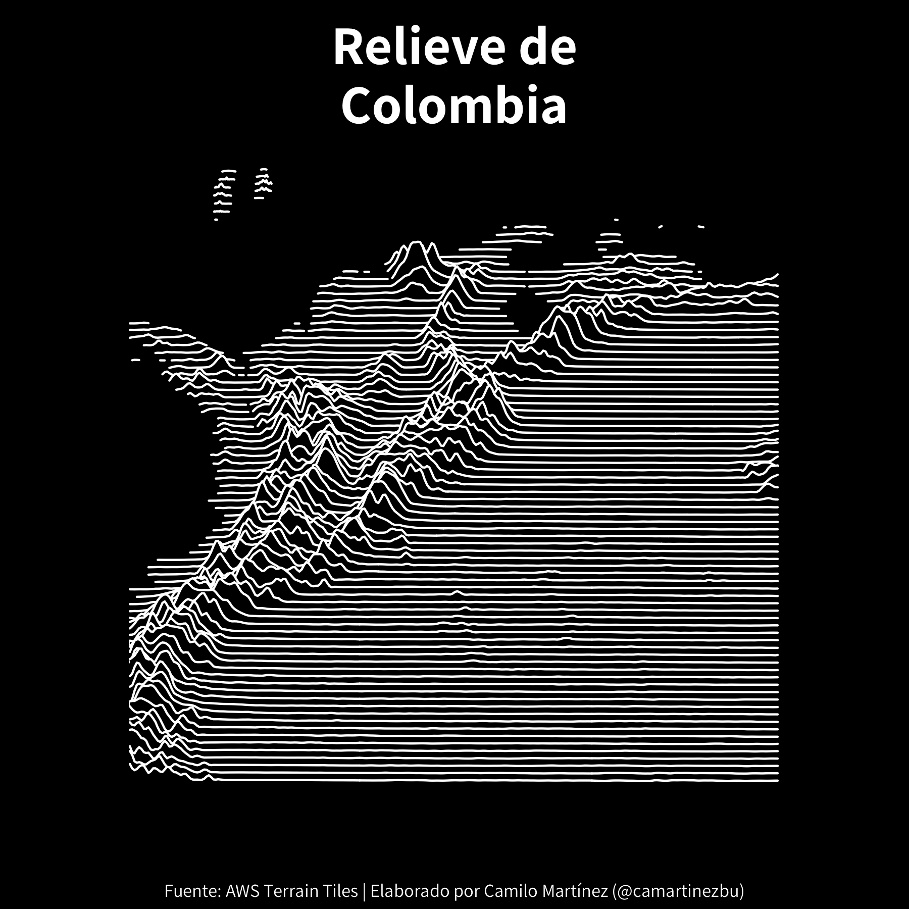

### Day 9. statistics

  
Click to expand!

  
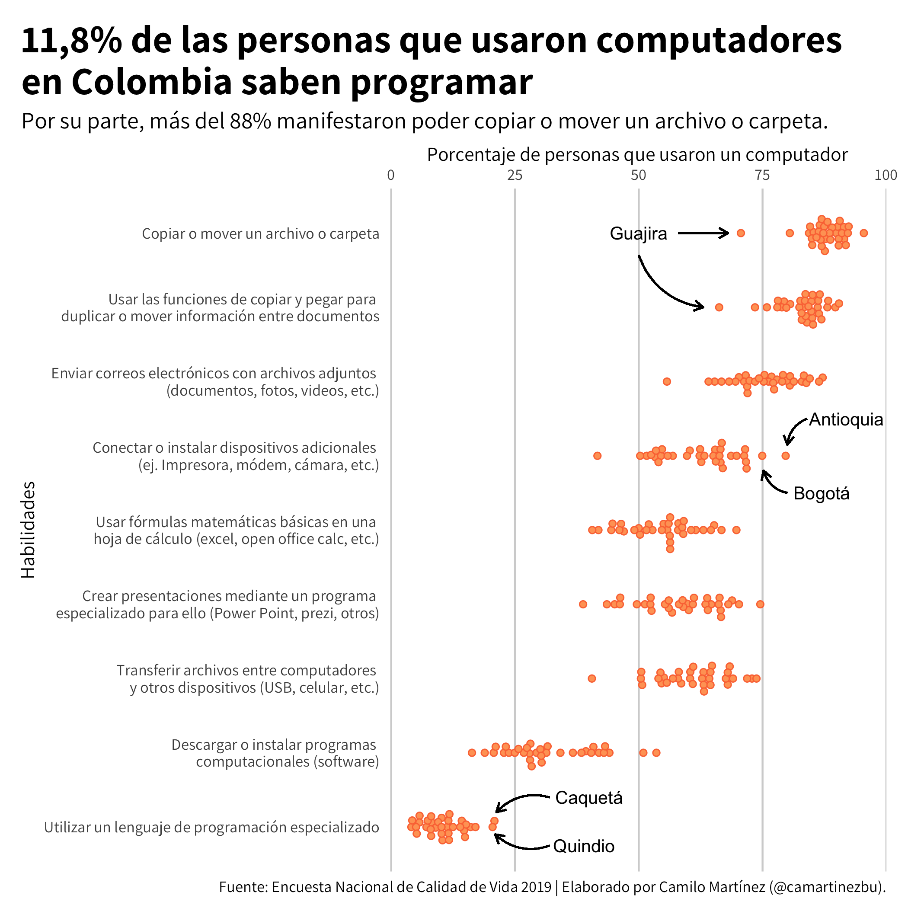

### Day 10. experimental

  
Click to expand!

  
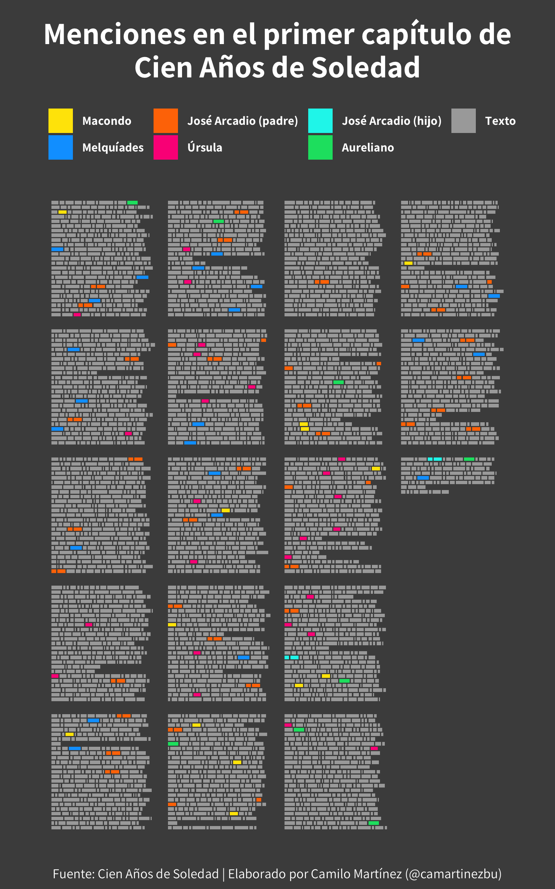

### Day 11. circular

  
Click to expand!

  
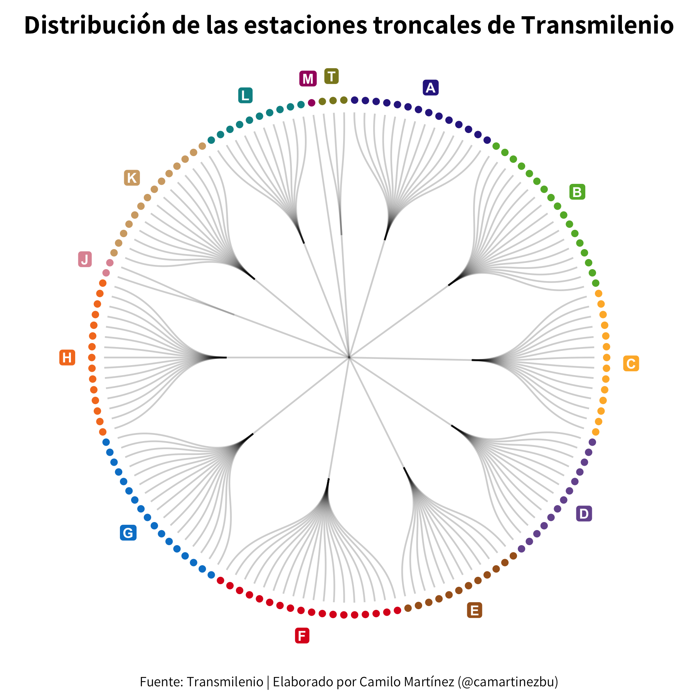

### Day 12. data day: The Economist

  
Click to expand!

  
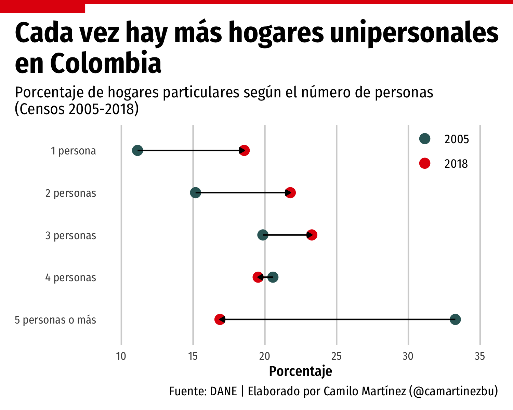

### Day 13. correlation

  
Click to expand!

  

### Day 14. 3 dimensional

  
Click to expand!

  
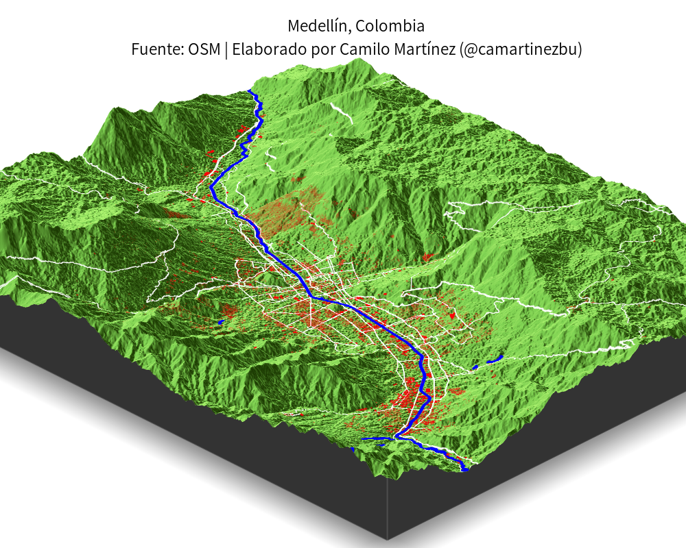

### Day 15. multivariate

  
Click to expand!

  
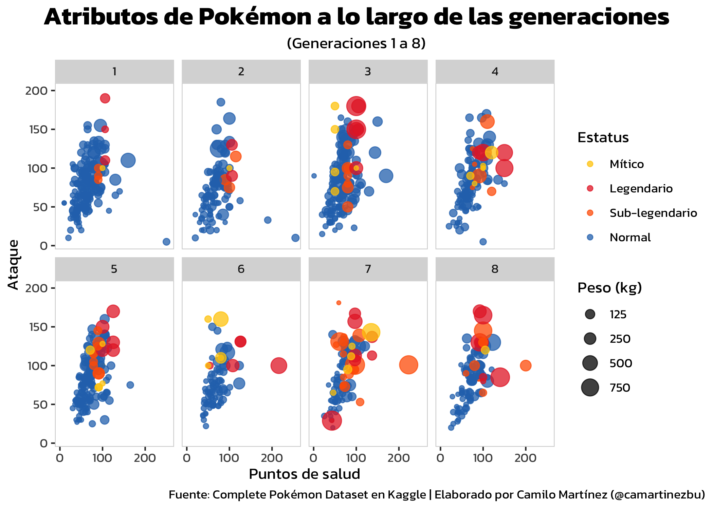

